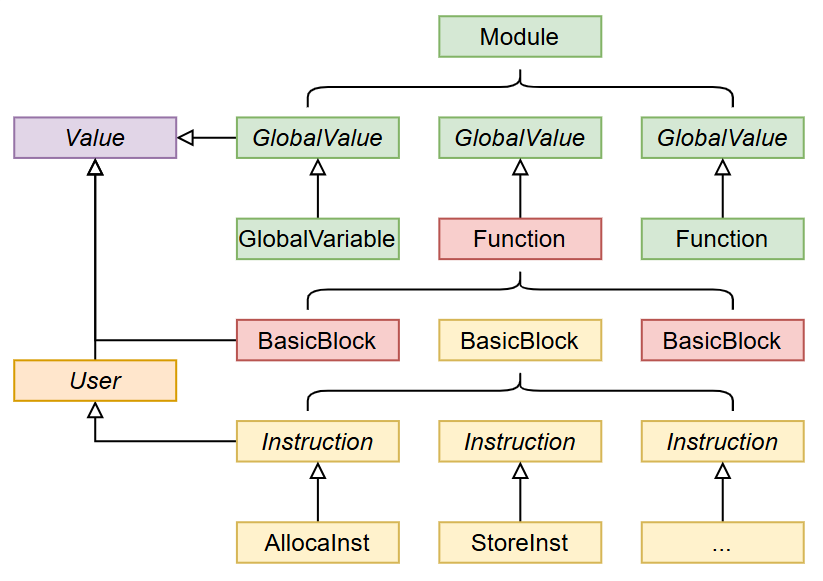

# E-Piler

## 参考编译器介绍

**总体结构**：编译器首先分为三部分：`src/`为源码部分，`test/`为测试部分，`tools/`为编译器开发和测试的辅助工具。

`src/`中`Compiler`为主类，在这里调用了词法分析、语法分析、生成中间代码与优化，最后输出结果。`front/`中包含了词法分析`lexer/`，语法分析`parser/`与`ast/`，前端于是可以完成词法分析语法分析，生成抽象语法树。`midend/`中完成了对于中间代码的生成。`backend/`中把中间代码翻译为目标mips代码。`error/`处理了各个阶段的错误，定义了所有的错误类型。`optimize/`中实现了各阶段需要的优化。`utils/`中有处理IO的和计算竞速复杂度的类。

**接口设计**：`Compiler`主类串联了各个阶段

`Frontend`:

- SetInput()：设置输入流。

- GenerateTokenList()：生成Token列表。

- GenerateAstTree()：生成AST语法树。

- GetTokenList()：获取Token列表。

- GetAstTree()：获取AST树。

`Midend`:

- GenerateSymbolTable()：生成符号表。

- GenerateIr()：生成IR中间代码。

- GetSymbolTable()：获取符号表。

- GetIrModule()：获取IR模块。

`Backend`:

- GenerateMips()：生成MIPS代码。

`Optimize`:

- Init()：初始化优化器。

- Optimize()：执行优化。

`utils`:

- IOhandler：负责输入输出的设置与打印。

- ErrorRecorder：错误记录与查询。

**文件组织**：`src/`为源码部分，`test/`为测试部分，`tools/`为编译器开发和测试的辅助工具。

 `src/`中:

`frontend/`: 前端模块，包含词法分析、语法分析、AST相关代码。子包：`lexer/`、`parser/`、`ast/`.

`midend`: `symbol/`（符号表）、`llvm/`（IR相关）、`visit/`（遍历与分析）

`backend`:BackEnd.java、MipsBuilder.java等、PeepHole.java（后端优化）

`utils`: ` IOhandler.java`（输入输出）、`Setting.java`（配置）、`HandleComplexity.java`（复杂度分析）

`Compiler.java`:编译器主控类，包含主方法，负责串联各模块。

## 编译器总体设计

**总体结构**：

分为前中后端三部分，同时也设计优化部分，对全流程进行优化。前端完成词法语法分析。中端完成语义分析与中间代码生成。后端完成mips代码生成。工具来处理输入输出与错误处理还有配置管理等等。

**接口设计**：

前端给出GenerateTokenList()：生成Token列表，GenerateAstTree()：生成AST语法树。

中端给出GenerateIr()：生成IR中间代码。

后端给出GenerateMips()：生成MIPS代码。

优化：Init()：初始化优化器。Optimize()：执行优化。

错误处理：ErrorRecorder：错误记录与查询

**文件组织**：

`src/`为源码部分，`test/`为测试部分，`tools/`为编译器开发和测试的辅助工具。

 `src/`中:

`frontend/`: 子包：`lexer/`、`parser/`、`ast/`，包含词法分析、语法分析、AST相关代码。

`midend`:  符号表、IR相关代码

`backend`: mips汇编生成相关代码

`utils`: ` IOhandler.java`（输入输出处理程序）、`Setting.java`（配置）、`HandleComplexity.java`（复杂度分析）

`Compiler.java`:编译器主控类，包含主方法，串联各模块。

## 词法分析设计

### 编码前设计

先建立Token类，作为词法分析的结果，属性包括token类型，token文本，行数。

因为token有很多类型，所以要建立一个对应关系，可以用java的给枚举类加属性的操作来实现。

还要读入文件把文件中内容转化为一个大的字符串。

然后就可以搭建有限自动机，用双指针，根据读到的内容不断推进，从而分析出各个单词。这里需要搭建多个有限自动机，然后共用一个相同的起始状态，把他们整理到一个大的有限自动机中。其中对于空白字符，先行指针跳过，然后到达非空白字符时停下，把先行赋值给后行指针。

然后得到的结果可以存在一个token的列表中，从而可以一个一个输出到文件中。

另外对于错误处理，仅需处理单个&或者|，因此包含在有限自动机的处理过程中了；但是为了方便后续编写，要建立错误类Error，并且把第几类这个信息包含进去，作为一个属性。

还要建立保留字表来确定是标识符还是保留字，这里可以建立一个映射，保留字的String与TokenType。

### 编码后修改设计

目前是有三个包，frontend，error，utils与不在包中的主类Compiler。

对于保留字，直接在Lexer类中写一个Map，最简单地实现保留字的映射。

对于Error类，学习教程中的给枚举类添加属性的操作，建立ErrorType类，实现了错误具体信息和类别的关系；在判断有没有错误来决定输出token还是错误的时候，根据一个全局的错误list来判断、实现。

对于文件读写设置了一个工具类FileProcess，在其中实现初始化输入输出与输入输出，还有关闭文件等等，其中要注意的是写文件还要flush。

在实现的细节上，我没有处理空白的跳过，是在for循环中自动跳过了。

**可能以后要注意的点**：目前错误类是静态的列表，如果多次运行要清空？

## 语法分析设计

### 编码前设计

主要要完成两部分，一个是AST的类的设计，另一部分是AST中的语法分析方法的设计。

AST的类设计：把一个推导定义为一个类，各个组成部分定义为属性。可以建立一个Node抽象类，让其他的节点全部继承Node，方便输入输出。但是具体这里它的用处还不是很清楚。

对于类中的语法分析方法，要进行预读入，然后再根据first集（这里不一定要终结符来判断，也可以用TokenType来判断）来进行判断非终结符走向。最后再用语法分析的Paser类进入开始符号来进行分析，自顶向下进行推导。

还要先建立一个TokenStream类来实现对于token流的操控，方便之后进行预读入等等操作，来判断非终结符的下面的走向。

错误类目前先用map来实现语法部分自己的错误管理。

还要记得最后输出错误的时候要进行对行号的升序排序。

对于某些文法像VarDef → Ident [ '[' ConstExp ']' ] | Ident [ '[' ConstExp ']' ] '=' InitVal，如果有文法开头为=，会不会影响互相的分析。这里也有最长匹配吗？

### 编码后修改设计

通过编写代码，我对于语法分析部分的了解更加充分了，通过建立AST类与定义其中的属性，相当于我规定了一棵子树，它的属性就是它的子结点。然后通过parse*的对于各种非终结符的分析方法，我对于输入的`TokenStream`从头到尾分析，并且从`CompUnit`进入，建立了一棵以`CompUnit`为根结点的语法树，可以供以后的分析使用。

在具体的设计中，我对于词法分析的错误在语法里面怎么处理这一点在之前搞错了，在词法分析中，我只是找到错误，没有帮助修正，因此这里把词法中的设计修正了，一个的& 或|，我都把他们改成两个，改成了一个正确的Token。

在debug过程中出现的一个比较容易忽略的错误就是用`!=`来判断文法中的`[]`和`{}`，就是重复0次或者一次或者多次，这里用`!=`后边的符号来判断的话，要看后边的符号是不是`;])`。因为这三者是可能丢失掉的，是错误类型，这时候再用!=来判断就会出现错误，具体还是要用`==`括号中或者分号之前的符号来判断。典型的就是`UnaryExp`。

但是在编写之后我对于这棵树怎么进行遍历来对后边的语义分析进行服务有些疑惑，有些有分支的非终结符我是用`utype`来判断，或许后边需要外部获取`utype`来判断分支走向。

## 语义分析

### 编码前设计

对于符号表，定义一个树形的符号表，虽然c语言可以用栈式符号表，但是java语言面向对象，建立一个树形的符号表也比较简单，更加高内聚低耦合。

对于Symbol中的属性，name，type，还有之后生成中间代码的相关信息（这个我暂时不知道后边要什么，先不写了）。对于Type，就用测评中的几个作为Type。

对于Symbol子类的创建，这里为了高内聚低耦合创建了VarSymbol和FuncSymbol，分别在两个子类中创建属于他们自己的属性。并且这里对于他们的构造函数，我想用ast的各种Node作为参数，重载几个构造函数，覆盖所有需要创建Symbol的情况。

这里我选择设计完符号表就要开始从根结点递归访问结点，把每个ast的结点的visit方法写在自己的类里面，其实这个和把visit方法写一个新的visit类里面是差不多的，主要是这里可能会影响之后的代码生成。

### 编码后修改设计

过完测试点之后，我对于语义分析（其实更多是创建符号表和错误检查）部分的理解更加深入了。这里要做完的只是这些任务，具体的深层的语义还要到生成中间代码的部分再解决。

对于设计上，我认为有几个比较困难的地方，首先是对于实参和形参的匹配的设计，这里从符号表中取出函数，得到它的形参；然后从调用函数的UnExp这里得到实参，主要的是对于类型的匹配，需要对Exp以及Exp往下推的那几个Exp类型的非终结符都判断类型，是一个递归调用的过程，从而得到Exp的类型，也就是FuncRParam的组成，由此可以判断实参的类型，可以和形参去比较来判断。

还有比较困难的地方就是对于错误判断的层次，像是`Stmt → LVal ‘=’ Exp ‘;’`中判断给常量赋值，然后在LVal里面自己判断ident是不是未定义，对于重定义我是在符号表管理中处理。

另外我加入了两个全局变量来处理错误，`curFuncSymbol`来判断是否在函数内，从而判断return语句的正确与否，这里是判断f类错误。对于g类错误，直接在函数定义的时候去判断，找Block的最后一个语句看是否是return。`inLoop`判断是否在循环类，用来辅助判断m类错误；`errorOn`判断是否再记录错误，用在预读回溯中（Stmt语法判断）；`printParser`用来判断是否输出语法成分，用途也是在预读回溯中（Stmt语法判断）。

另外这里我把错误类优化了，新加了一个管理类，通过全局静态函数来addError，这样比直接把errors列表给出更加安全。

对于我的bug，这里找到了好几个，首先是Stmt中对于` Stmt → LVal '=' Exp ';'  | [Exp] ';' `这两种的判断有问题，我之前读到ident再读到`[`或者`=`都判断为赋值，但是Exp中可以有前者，这里改为用预读Exp和回溯的方法，因为Exp也是Lval，再判断下一个符号，如果是`=`，就是Lval，否则就是Stmt，这样来判断是前者还是后者，是一种回溯的思想；还有tokenStream中用了一个没有初始化的变量来判断长度；还有对于continue和break那里笔误写错了两处；还有对于`InitVal → Exp | '{' [ Exp { ',' Exp } ] '}' `这里在构造函数笔误了；还有对于它和` ConstInitVal → ConstExp | '{' [ ConstExp { ',' ConstExp } ] '}'`，在check的时候，如果是第二种情况，要判断第一个元素是不是空。

最后耗费我最多时间的一个bug就是判断e类错误的时候，函数形参可能为null，这里不能直接`.size`，要在原函数里封装一下判断长度或者判断是否为null。

## 代码生成设计

### 中间代码即LLVM代码生成

#### 编码前设计

阅读了教程之后，我理解了要建立一个LLVM IR的数据结构，可以把LLVM IR的继承关系拿过来参考，比较恰当的就是这个图，一切皆Value，都继承Value，然后这些组成了一个Module，也就是我们的一次编译的过程。这里我们创建Value、Module、IrBuilder、User、BasicBlock、Instruction、Function、Type等类，相当于建立了一个模板，Function组成了Module，BasicBlock组成了Function，Instruction组成了BasicBlock，其中Ins又分为各种不同的指令。然后还要建立Type类和他的子类，然后每个Value有自己的Type，方便后续管理。

其中ValueType有FunctionType，ArratType，IntegerType， LabelType，PointerType，StringType，VoidType。

对于常量，我有ConstInt，ConstArray，ConstString，Constant。常量有一个属于自己的ValueType。

对于指令，Instruction继承自User，他的ValueType代表自己的返回值类型，即IntegerType或者VoidType。



所以我们需要构建的就是这么一个LLVM IR的树，然后通过遍历树，来调用各个结点的toString方法，就能生成对应的LLVM IR。

想要生成这么一棵树，我们仍然从语法树下手，递归遍历语法树，调用各个结点的buildIr函数，生成对应的LLVM数据结构。这一步通过IrBuilder中的静态方法来实现，在IrBuilder中实现对LLVM的Value的创建。其中需要在自顶向下分析中传递的继承属性和综合属性我通过ast结点的静态变量来实现，其中有的可以压缩为一个变量的，就不用栈来处理，但是这样压缩可能会有风险，要确定好可以压缩。

#### 编码后设计

整个LLVM的生成我感觉最难的一步还是对于整个Module的构建，包括其中的Value以及其子类和常量等之间的关系，以及他们的Type，整体架构构建好剩下的就比较通畅了。

我的Type分为两种，一种是ValueType，包括FuncType，LabelType；另一种是`DataType`，是实际的数据类型，一共有五个，分别是`IntegerType`,`ArrayType`,`PointerType`,`StringType`，`VoidType`。（但是其实`DataType`也继承自`ValueType`）

然后`Value`有一个属性就是自己的`ValueType`, 因此所有他的子类也是这样。其中我划为一组的就是constant包，他的`Type`就是正常的自己的类型；然后指令的`ValueType`代表指令的返回值；函数的`ValueType`是`FuncType`，里面有它自己的返回值和参数个数和参数类型信息。

因为我们没有char类型，所以我没有设计Integer(8)这一类型，对字符串常量，我才用`StringType` `StringConst`来整体的简单处理。

另外对于开头要加入的声明语句，我选择建立声明语句这一Value的子类。

然后对于语法树到LLVM树的生成，我选择在每个语法结点中递归进行，用buildIr()函数。整体进行上尤其要注意对于常量的处理，可能是常量的地方，我都使用`isglobal`全局静态变量进行判断，是常量的话需要额外处理，否则会往BasicBlock里加入指令，但是常量（llvm的，即全局的常量，或者数组的大小）不处在任何BasicBlock中，因此会RE；所以常量的值我直接在我的`buildIr()`函数中算出来。

另外还有需要注意的是继承属性和综合属性的传递，因为我是递归访问结点，因此我在`Node` 父类中存放这些属性，但是这里我曾经出现了一个RE，因为我错误地压缩了一个继承属性funcTypesDown，本该用一个栈，我用了单变量，导致嵌套的的访问覆盖了外层的变量，出现RE。另外这里一个重要的继承属性就是在短路求值部分的`TrueBlock` 、`FalseBlock`，这里嵌套也可能会有问题，用栈也比较麻烦，因此我直接在函数里传参，我认为这是一种更健壮的写法。

另外对于`continue`与`break`，他们也需要获得到`TrueBlock` 、`FalseBlock`，但是他们是`Stmt`，无得到的实参，因此我还是用了两个栈，一个表示for的update块，一个表示for后紧挨着的块，分别供二者跳转。

对于防止一个`BasicBlock`末尾出现多个跳转语句，我在Br或者ret的时候会进行判断，如果最后语句是这两种之一，我就不会再添加。

对于我出现的错误，上面的错误地压缩栈为单变量为一个，还有就是对于符号表的处理，因为我使用的是在语义分析阶段就已经建立好的符号表，一个Lval会拥有整个作用域内的变量的信息，即使这个变量还未定义，如下，b会错误地使用单变量a，从而导致RE，因为它还没有Value对应，正确的使用是全局的数组a。因此我进行判断，如果Value为null，就循环往父符号表寻找这一变量，这样就正确了。

```c
int a[1] = {0};

int main() {
    int b[2] = {a[0], 1};
    const int a = 3};
    return 0;
}
```

另外的一个错误就是对于Icmp的操作数，可能会有i1，我一开始这里没有进行扩展，所以错误了。

### mips生成

#### 编码前设计

从llvm生成mips，本质上是四元式转四元式，但是可以预见的是，主要会遇到 **寄存器分配和存取栈** 的问题和 **函数调用保存寄存器、传参、修改sp**的问题。

##### **MIPS架构**

MIPS模块自己的架构是这样的，一个module作为主体，其中包含了 `globalVariables` 和 `functions`，分别也对应llvm的 `globalVariables` 和 `functions` ，`globalVariables`  就是data段， `functions`就是text段。

`functions` 里面包含了自己的`blocks`，每个`block`里又包含了自己的`instructions`。`instruction`是一个抽象类，由各类真实的指令实现。

`instruction`所操作的操作数我使用`MipsOperand`抽象类来填充，由`imm`, `phyReg`, `label`来实现。

因此就构成了基本的MIPS架构。

##### 寄存器分配和栈的存取

这里为了降低难度，先实现一个完整的编译器，我这里先采用了全栈式的计算方法，就像PCODE那样，常规计算只用到三个寄存器：`t0`, `t1` , `t2`，使用操作数入寄存器然后结果弹出寄存器、记录在栈中的简单方式，先不管性能。

当然了函数操作必须的`a0`-`a3`  仍然是必须的，`sp`, `v0`仍然是必须的。

##### 函数调用的传参与修改SP

首先说SP的修改，因为我使用的是栈式存取，不方便在程序一开始就确定每个函数的所需要的空间，因为可能会有中间变量，这是第一遍之前统计不到的，如果要统计，也是在第二遍中统计，更不方便了，因此我采取FP和SP的双重设计，对于一个函数，SP是变的，FP是定的，因此存取变量、算变量在栈中的偏移量什么的，都用FP来计算。函数调用的过程中，FP在调用者保存的自己的FP、SP、RA之下，在被调用者的参数之上，同时栈中也给前四个参数留出空间，SP直接在参数下面了。

##### 对于每个LLVM Value的翻译

我在每个Value的类里面加入了`toMips()`方法来实现翻译，递归翻译之前建立的LLVM的树。

#### 编码后设计

编码后发现了一些问题。对于FP，它不会在开始被初始化，所以main函数开头要写一句`move fp sp`。

对于LLVM的跳转部分，这里也是比较值得关注的。相比翻译为LLVM，简单的是这里我们不用处理短路求值了，只需要忠实地翻译LLVM即可。无条件跳转只需要J即可，对于有条件跳转我简单地只采用了一个b指令就是beqz, 生成： `beqz cond elseBlock`这种样式，然后在跟一条`j thenBlock`，这里我们给`MipsBlock`也加入了`trueBlock` `falseBlock`, 方便之后做优化，这里需要在Br的toMips里面设置，也只有在这里设置，但是容易搞错的点是：`MipsBlock`的`trueBlock` `falseBlock`这里的true和false指的不是beqz的真假，而是beqz成立的时候是false，反之走 `j thenBlock` 是true。

##### 犯过的错误

另外我还错在函数调用中的计算FP部分，这里要多加注意：FP在调用者保存的自己的FP、SP、RA之下，在被调用者的参数之上，同时栈中也给前四个参数留出空间，SP直接在参数下面。

我还犯了一个四个参数之后从栈中取值不正确的问题，因为没有正确记录参数在栈中位置。

##### 系统调用

对于输入输出等系统调用，我采用整体处理的方式，即`li v0, x    syscall`两条都设置在`MipsSyscall`中，方便处理，便于理解。

##### 方便调试的Empty

为了方便我的MIPS调试，让生成的mips文件更有可视性，我在LLVM的每个Value的`toMips`末尾加入了一个`MipsEmpty`指令，这样能很快看出谁是同一个模块。

## 代码优化设计

### 编码前设计

采用分层优化的策略。

#### 1. 中端优化

中端优化主要在中间代码层面进行，旨在简化控制流图（CFG）并将内存操作提升为寄存器操作（SSA形式），从而减少访存指令。

##### 1.1 控制流图构建与清理

- **功能**: 遍历函数的基本块，建立基本块之间的前驱和后继关系。
- **死代码消除**: 在构建 CFG 的过程中，移除不可达的基本块（即没有前驱的块，入口块除外），并维护图的连通性。

##### 1.2 支配树分析

为了支持 Mem2Reg 等高级优化，实现支配性分析：

- **支配树构建**: 使用迭代算法计算每个基本块的支配者，并构建支配树。
- **直接支配者**: 识别每个基本块的直接支配者。
- **支配边界**: 计算每个基本块的支配边界 *DF*(*n*)，这是插入 *ϕ* 函数的关键依据。

##### 1.3 Mem2Reg

该模块将栈上的局部变量（`alloca` 指令）提升为虚拟寄存器，构建静态单赋值（SSA）形式。

- 基本流程
  1. **筛选**: 仅处理非数组类型的 `alloca` 指令。
  2. 特殊情况优化
     - **Unused Alloca**: 如果 `alloca` 没有使用者，直接删除。
     - **Only Store**: 如果变量只有存储没有读取，删除相关的 `store` 和 `alloca`。
     - **One Block**: 如果变量的定义和使用都在同一个基本块内，直接进行局部替换，无需插入 *ϕ* 节点。
  3. Phi 节点插入
     - 利用 calIDF方法计算**迭代支配边界**。
     - 在所有定义了该变量的基本块的支配边界处插入*ϕ* 指令。
  4. **变量重命名**: 遍历支配树，将 `load` 指令替换为当前最新的值，处理 `store` 指令更新当前值，并填充 *ϕ* 节点的参数。


#### 2. 后端优化

后端优化在 MIPS 代码生成阶段或生成后进行，主要关注寄存器分配效率和指令级简化。

##### 2.1 活跃变量分析

- **算法**: 采用基于数据流的迭代算法。
- **计算内容**: 对每个基本块计算 Liveuse 和 Livedef，进而迭代求解 Livein和 Liveout集合。
- **作用**: 为寄存器分配器提供冲突检测依据，也用于死代码消除。

##### 2.2 图着色寄存器分配

实现了基于图着色的全局寄存器分配算法，将无限的虚拟寄存器映射到有限的 MIPS 物理寄存器。

- 主要阶段


1. **Build**: 利用活跃变量分析结果构建冲突图。如果两个变量同时活跃，则在它们之间连线。
2. **Simplify**: 移除度数小于物理寄存器数量的节点并压栈。
3. **Coalesce**: 尝试合并由 `move` 指令连接的两个节点，消除冗余的移动指令。
4. **Freeze**: 当无法简化且无法合并时，放弃某些Move-Related节点的合并机会，将其标记为可简化。
5. **Spill**: 如果图无法着色，根据启发式代价函数（引用计数）选择节点溢出到栈上。
6. **Rewrite**: 为溢出节点插入 `load`/`store` 指令，并重新开始分配流程。

（这里我的图着色其实是参考了虎书的）

##### 2.3 窥孔优化

在基本块内部进行指令窗口滑动，识别并简化特定指令序列。

- 代数化简

  删除类似如下指令即加0减0：

  - `add $t0, $t0, 0` 
  - `sub $t0, $t0, 0` 

- 冗余移动消除

  删除类似如下指令即对同一个寄存器的move：

  - `move $t0, $t0` 

- 数据流窥孔

  - 结合活跃变量分析，如果某条指令定义的寄存器在后续不再活跃，且该指令无副作用（非跳转、非系统调用），则将其删除。

- 控制流简化

  - 移除无效的分支指令（跳转目标即为下一条指令）。


### 编码后设计

#### Mem2reg

-  **遇到过的问题 **：

   ​	这里其实加phi不容易出错，容易出错的是目标代码生成的消除phi。

   ​	由于我在代码，生成目标代码消除phi指令的时候用到Br转mips代码，只使用了beqz这一个b指令，所以在对ir的thenBlock和elseBlock、mips的trueBlock和falseBlock要注意一个转换，ir的thenBlock其实是对应的falseBlock。

   ​	我还生成过mipsEmpty，用于在每个ir的指令最后输出一个空行，方便我去看生成的mips代码，但是也算一个mips指令数据结构，从而非常容易产生错误，因为在消除phi指令的时候，需要给前序块加一些指令，加到最后或者倒数第二条的都有，这里mipsEmpty就会来添乱，因此mipsEmpty是一个很差的设计，我全部删除掉。

- 难点：
  在 SSA 形式下，需要确保在控制流图的任意路径上，load指令都能获取到该路径上最新的变量定义。由于控制流存在分支和汇合，不同路径对同一变量的定义状态是不同的，如何隔离不同分支的状态是一个难点。

- 解决方案：

  - DFS 遍历 
    - 我放弃了复杂的递归回溯状态恢复机制，转而采用显式栈进行 DFS 遍历。
    - **状态隔离**：在遍历过程中，维护一个映射表 `HashMap<Alloca, Value>` 记录当前路径上所有变量的最新值。
    - 当控制流从当前块流向后继块时，我克隆当前的映射表，将其作为后继块的初始状态压入栈中。

#### 寄存器分配

- **出现过的错误**  ：

  这里用到了我自己定义的一个类似c++的pair，这里一定要定义它的hashCode方法，否则会出现错误，同时也要注意定义物理寄存器的hashCode和equals方法。

- 难点

  - 当冲突图无法着色时，必须选择一个节点溢出到内存。

    ​	**方案**：设计代价函数 Cost=Occurrences/Degree。优先溢出引用次数少且冲突度高的变量，以最小化内存读写开销并最大化图的简化程度。

  - 盲目消除 `move` 指令可能导致合并后的节点度数激增。

    ​	**方案** ：采用 Briggs 策略。仅当合并后的节点其度数大于物理寄存器数的邻居个数小于物理寄存器数时才允许合并。这在消除冗余指令的同时，数学上保证了图的可着色性不受破坏。

  - 当图中仅剩MOVE有关的低度数节点，且无法满足合并条件时，算法会卡死。

    ​	**方案**：引入冻结阶段。强制放弃某些节点的合并机会（不再视为MOVE有关），将其移入简化队列，从而打破僵局，推动算法继续进行。

#### 窥孔优化

- **出现过的错误** ：

  ​	这里因为使用到了java迭代器，需要对其熟练掌握，我这里就因为不熟练出错了。